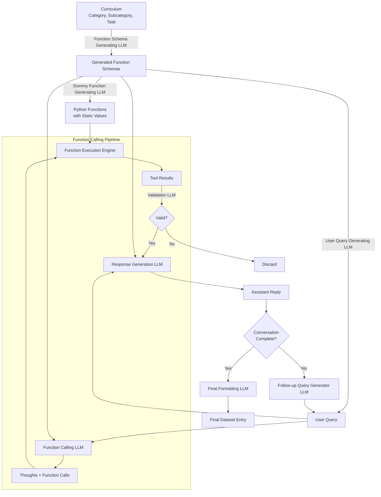

# chained-tool-datagen

The general idea of the pipeline is this (currently in development):


## Installation and Setup

1. Install the required packages using the following command:
```bash
make install
```

And you should be good to go.

## Usage

### 1. Generating Function Schemas

To generate function schemas, run the following command:
```bash
make run_schema_gen
```

which will save the results to `results/function_schemas.json`.

### 2. Generating User Queries

To generate user queries, run the following command:
```bash
make run_user_query_gen
```

which will save the results to `results/user_queries.json`.

### 3. Generating Dummy Functions

To generate dummy functions, run the following command:
```bash
make run_dummy_function_gen
```

which will save the results to `results/dummy_functions.py`.