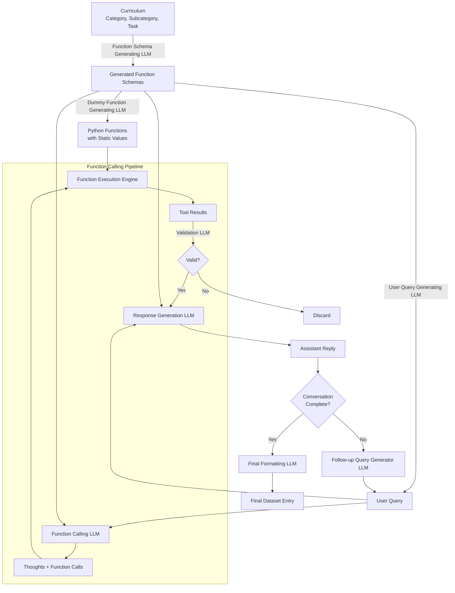

# chained-tool-datagen

The general idea of the pipeline is this (currently in development):


## Installation and Setup

1. Pull [data-genie-agents](https://github.com/interstellarninja/data-genie-agents):
```bash
make data_genie_setup
```

2. Create a virtualenv and install the requirements:        
```bash
make install
```

3. Add your `GROQ_API_KEY` to the `.env` file.

## Usage

To run the pipeline:
```bash
make run
```
